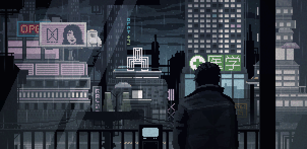
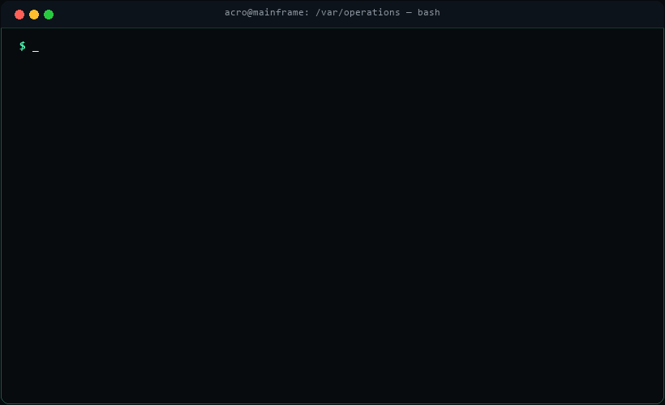
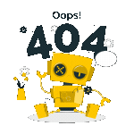

<!-- Huge "ASHISH -> ACRO" Hero Text matching the site -->

<!-- Subtitle Loop matching the site -->

  

<!-- Alone GIF right below the name header -->

  

 

**Terminal operations strictly classified. Welcome to my GitHub workspace.**

I am a Cybersecurity Researcher and Full-Stack Architect obsessed with zero-latency software, offensive security frameworks, and privacy-first architectures. I don't just write code; I build unbreakable infrastructure. From deep penetration testing tools to human-like AI environments, my deployments operate flawlessly in the shadows.

 

 

<!-- NOW PLAYING // AUDIO FEED SECTION -->

  

  

 

<!-- LIVE INTEL & ROTATION ENGINE SECTION -->

  

  

  

 

<!-- CORE COMPETENCIES & TECHNICAL ARSENAL -->

  

<!-- Full-Fidelity Animated Dev Icons -->

  

  
  
  
  
   
  
  
  
  
  
  

 

<!-- TELEMETRY & GITHUB METRICS SECTION -->

  

  
  

  

  

  

 

<!-- DEPLOYED OPERATIONS SECTION -->

  

<!-- Live Animated Terminal Manifest -->

  

  
  
  
  

 

<!-- TRANSMISSION LINKS -->

  

  
  
  

 

<!-- TERMINAL ERROR 404 & VISITOR METRICS FOOTER -->

  
    
  

